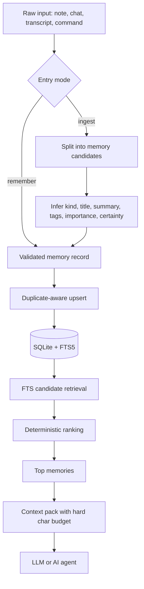
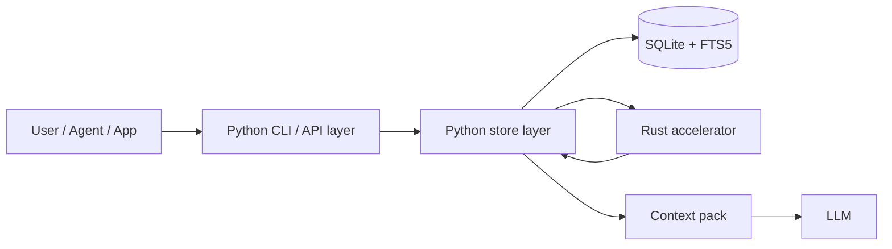

# Memory Kernel: для чого воно і як з ним працювати

## Що це

`Memory Kernel` — це локальне ядро пам'яті для AI-агентів і LLM-застосунків.
Його задача не "пам'ятати все підряд", а повертати тільки корисний, точний і дешевий контекст.

## Старт за 5 хвилин

Якщо не хочеш зараз розбиратися в `FTS5`, ranking і context pack, використовуй програму так:

1. Встанови пакет:
   `pip install -e .`
2. Створи локальну базу:
   `memory-kernel init`
3. Збережи одне важливе рішення:
   `memory-kernel remember --scope my.project --kind decision --title "Що вирішили" --content "Зберігаємо пам'ять локально на машині користувача."`
4. Потім дістань це назад:
   `memory-kernel search "локальна пам'ять"`
5. Зроби backup:
   `memory-kernel export --format json --output exports\memory.json`

Цього вже достатньо, щоб почати користуватись системою без занурення у внутрішню архітектуру.

## Стадія проєкту

Поточна стадія: робоча alpha.

- CLI вже працює;
- є тести;
- є export / import;
- є optional Rust accelerator;
- Python fallback працює без native-збірки.

Але ще не завершено:

- готові wheels для основних платформ;
- guided ingest для нетехнічного користувача;
- зовсім простий consumer-style onboarding.

## Для кого це зараз

Найкраще підходить, якщо тобі потрібні:

- локальна пам'ять на своїй машині;
- контроль над тим, що саме зберігається;
- прозорий export / import;
- малий і передбачуваний контекст для моделі.

Слабше підходить, якщо ти очікуєш:

- повністю hosted experience без локального сетапу;
- максимально автоматичну структуризацію хаотичних нотаток;
- consumer-продукт, де все працює "само" без дисципліни записів.

Це рішення потрібне там, де звичайні memory-системи дають дві проблеми:

- повертають розмиті й малокорисні записи разом з важливими;
- самі з'їдають занадто багато ресурсів на пошук, ранжування і підготовку prompt.

## Для чого це підходить

- локальна пам'ять для AI-агентів;
- пам'ять рішень і обмежень по проєкту;
- зберігання коротких фактів, задач, переваг користувача;
- перетворення нотаток, стенограм і chat logs у структуровану пам'ять;
- побудова маленьких `context pack` для LLM без перевантаження prompt.

## Головна ідея

Система не покладається на "магічну" fuzzy memory.
Вона працює так:

1. Текст зберігається локально в `SQLite`.
2. Для пошуку використовується `FTS5`.
3. Кожен запис має чіткий `kind`:
   `decision`, `constraint`, `preference`, `task`, `fact`, `note`.
4. Пам'ять ранжується детерміновано, а не випадково.
5. У prompt віддається не вся база, а короткий pack з лімітом символів.

## Принцип роботи

### На практиці це виглядає так

1. У систему потрапляє або один точний запис через `remember`, або сирий текст через `ingest`.
2. Якщо це сирий текст, він ріжеться на окремі memory-кандидати.
3. Для кожного кандидата визначаються:
   `kind`, `title`, `summary`, `tags`, `importance`, `certainty`.
4. Запис зберігається в `SQLite`, а duplicate-aware логіка не дає базі розростатися однаковими дублями.
5. Під час пошуку `FTS5` знаходить кандидатів.
6. Далі кандидати ранжуються евристично:
   lexical match, actionability, certainty, importance, recency, reuse.
7. Для моделі збирається маленький `context pack`, а не дамп усієї пам'яті.

### Що тут найважливіше

- спочатку cheap lexical retrieval;
- потім детерміноване ranking-рішення;
- потім жорсткий budget на фінальний контекст.

Саме ця послідовність і зменшує розмитість та навантаження.

## Схема роботи

### Потік даних



### Схема компонентів



### Схема даних одного memory-запису

```text
MemoryRecord
├─ scope
├─ kind
├─ title
├─ summary
├─ content
├─ tags
├─ source
├─ importance
├─ certainty
├─ access_count
├─ created_at
├─ updated_at
└─ last_accessed_at
```

## Чому це краще за важкі memory-стеки

- немає обов'язкового vector DB;
- немає постійних embedding-витрат;
- менше latency;
- простіше дебажити, бо записи зберігаються у явному вигляді;
- легше контролювати, що саме потрапляє в модель.

## Архітектура

### Python-рівень

Python відповідає за:

- CLI;
- роботу з `SQLite`;
- міграції схеми;
- fallback-режим, якщо native-модуль не зібраний.

### Rust-рівень

`Rust` прискорює гарячий шлях:

- ingest raw text;
- duplicate-aware upsert логіку;
- евристики для `kind`, `title`, `summary`, `tags`;
- експериментальний ranking кандидатів після пошуку;
- експериментальну побудову `context pack`.

Якщо ти вбудовуєш це як Python-бібліотеку, `MemoryStore` тримає довгоживуче `SQLite`-з'єднання заради продуктивності. Найкраще використовувати `with MemoryStore(...) as store:` або явно викликати `store.close()`.

Якщо native-модуль доступний, `memory-kernel stats` покаже активний accelerator і рушії гарячих шляхів:

```text
accelerator: rust
ranking engine: adaptive (rust when candidates >= 24)
upsert engine: rust-assisted duplicate merge
```

## Основні режими роботи

### 1. `remember`

Використовуй, коли ти вже знаєш точний запис, який треба зберегти.

Приклади:

- важливе рішення;
- критичне обмеження;
- стійка перевага користувача.

### 2. `ingest`

Використовуй, коли є сирий текст:

- нотатки з мітингу;
- стенограма;
- лог сесії агента;
- текстовий чернетковий документ.

Система сама:

- розіб'є текст на memory-кандидати;
- призначить `kind`;
- згенерує `title`, `summary`, `tags`;
- оновить дублі замість розростання бази.

### 3. `search`

Потрібен, коли треба знайти точний контекст за запитом.

### 4. `context`

Потрібен, коли треба підготувати короткий набір пам'яті для prompt.

### 5. `wake-up`

Потрібен для стартового "гарячого" набору пам'яті без конкретного пошукового запиту.

### 6. `stats`

Показує стан бази і активний accelerator.

### 7. `export`

Потрібен, коли треба вивантажити пам'ять у переносний файл для backup, переносу на іншу машину, аудиту або подальшої обробки.
Підтримуються два формати:

- `json` для одного повного snapshot-файлу з метаданими;
- `jsonl` для построчного експорту, де один memory-запис = один рядок.

### 8. `import`

Потрібен, коли треба відновити пам'ять із попереднього `export`.
Команда читає `json` або `jsonl` і робить idempotent upsert по `id`, тому той самий export можна безпечно імпортувати повторно.

## Рекомендований робочий цикл

### Для команди

1. Після важливої зустрічі робимо `ingest` по нотатках.
2. Для особливо важливих рішень додаємо окремі `remember`.
3. Перед запуском агента будуємо `wake-up`.
4. Під конкретну задачу даємо агенту `context`.

### Для AI-агента

1. Завантажити маленький `wake-up`.
2. На конкретну задачу виконати `search` або `context`.
3. Після завершення роботи зберегти нові рішення через `remember` або `ingest`.

## Як користуватися програмою покроково

1. Один раз створи базу:
   `memory-kernel init`
2. Якщо маєш один точний факт або рішення, використовуй `remember`.
3. Якщо маєш нотатки, стенограму або chat log, використовуй `ingest`.
4. Перед реальною задачею діставай пам'ять через `search`, `context` або `wake-up`.
5. Регулярно роби `export`, щоб мати переносний backup пам'яті.
6. На іншій машині або в новій базі використовуй `import`, щоб відновити експортовану пам'ять.

## Приклади команд

### Ініціалізація

```powershell
memory-kernel init
```

### Додати один точний запис

```powershell
memory-kernel remember `
  --scope project.ai-memory `
  --kind decision `
  --title "Use SQLite FTS5" `
  --content "We replaced the heavy vector stack with SQLite FTS5 for fast local retrieval."
```

### Інгест нотаток

```powershell
memory-kernel ingest `
  --scope project.ai-memory `
  --file notes.txt `
  --source sprint-review `
  --tags transcript planning
```

### Пошук

```powershell
memory-kernel search "prompt budget"
```

### Побудова context pack

```powershell
memory-kernel context "How do we keep memory cheap?" --budget-chars 700
```

### Експорт у JSON

```powershell
memory-kernel export `
  --format json `
  --output exports\memory.json
```

### Експорт одного scope у JSONL

```powershell
memory-kernel export `
  --scope project.ai-memory `
  --format jsonl `
  --output exports\ai-memory.jsonl
```

## Як експортувати пам'ять

### Для backup

```powershell
memory-kernel export --format json --output exports\memory-backup.json
```

Це створює один файл зі службовими метаданими, кількістю записів, фільтрами і самим масивом пам'яті.

### Для переносу частини бази

```powershell
memory-kernel export --scope project.ai-memory --format json --output exports\project-ai-memory.json
```

Це зручно, коли треба вивезти тільки один проєкт або один простір пам'яті.

### Для pipeline або подальшої обробки

```powershell
memory-kernel export --scope project.ai-memory --format jsonl --output exports\project-ai-memory.jsonl
```

`jsonl` зручний, якщо далі файл буде читати інший скрипт, ETL-процес або зовнішній інструмент.

### Що важливо знати

- `export` нічого не змінює в базі, це read-only команда;
- можна фільтрувати по `scope`, `kind`, `tags` і `limit`;
- якщо `--output` не вказати, експорт піде в stdout.

## Як імпортувати пам'ять

### Відновити повний snapshot

```powershell
memory-kernel import --file exports\memory-backup.json
```

### Імпортувати JSONL-експорт

```powershell
memory-kernel import --file exports\project-ai-memory.jsonl
```

### Що важливо знати

- `import` підтримує `json`, `jsonl` і auto-detect по розширенню;
- повторний імпорт того самого export не повинен плодити дублікати по `id`;
- під час import зберігаються `id`, `created_at`, `updated_at`, `access_count`;
- після import записи одразу доступні для `search`, `context`, `wake-up`.

## Коли краще `remember`, а коли `ingest`

Обирай `remember`, якщо:

- запис уже чітко сформульований;
- треба контроль над `kind`, `importance`, `certainty`;
- це ключове рішення або правило.

Обирай `ingest`, якщо:

- є багато сирого тексту;
- треба швидко витягнути структуровані memory-одиниці;
- важливо не плодити дублікати.

## Що краще не зберігати

- шумові переписки без рішення;
- тимчасові емоційні репліки;
- великі неструктуровані дампи "про всяк випадок";
- те, що не повинно потрапляти в prompt або локальну БД.

## Native accelerator

### Навіщо він потрібен

Щоб витрачати ресурс не на overhead Python-циклів, а на реальну продуктивність:

- швидший ingest;
- швидший duplicate-aware upsert;
- швидше ранжування;
- дешевша збірка контексту.

### Як зібрати

```powershell
.\scripts\build_native.ps1
```

### Як заміряти виграш

```powershell
python .\scripts\benchmark_ingest.py
```

```powershell
python .\scripts\benchmark_upsert.py
```

### Експериментальний native ranking

Він уже реалізований, але за замовчуванням вимкнений.

Причина проста:

- для типових малих вибірок кандидата JSON-перехід Python -> Rust -> Python може коштувати дорожче за сам Python ranking;
- тому default path орієнтований не на "просто все винести в native", а на реальну продуктивність.

Увімкнути його для профілювання можна так:

```powershell
$env:MEMORY_KERNEL_EXPERIMENTAL_NATIVE_RANK=1
```

## Практичний сенс для продукту

Це ядро потрібне не для "довгої романтичної пам'яті ШІ", а для керованої робочої пам'яті:

- менше сміття в retrieval;
- менше витрат на пам'ять;
- стабільніший prompt;
- більше контролю над тим, що саме пам'ятає агент;
- простіший шлях до production.
