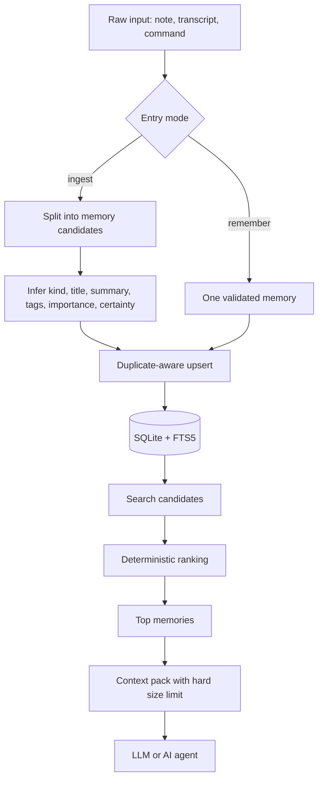
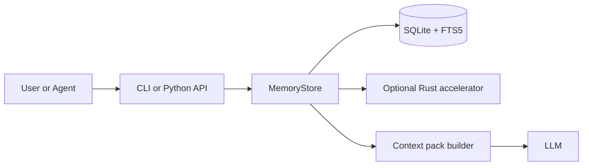

# Memory Kernel

`Memory Kernel` is a small local memory layer for AI agents.

It helps you save useful things such as decisions, constraints, tasks, facts, and notes in a local SQLite database, then pull back only the few memories that matter for the current task.

Published package name on PyPI: `amormorri-memory-kernel`
CLI command after install: `memory-kernel`

Practical guide in Ukrainian:
[docs/OPERATING_GUIDE_UK.md](docs/OPERATING_GUIDE_UK.md)

Release notes:
[CHANGELOG.md](CHANGELOG.md)

## What It Does

In plain English, Memory Kernel does 4 things:

1. Stores memory locally on your machine.
2. Keeps memory structured enough to stay useful.
3. Finds relevant records without a heavy vector stack.
4. Builds a small context pack instead of dumping everything into the prompt.

This project is not trying to create a magical black-box memory. It is trying to create a memory layer you can inspect, control, export, and trust.

## Start In 5 Minutes

If you just want to try it, do this:

```powershell
pip install amormorri-memory-kernel
memory-kernel init
memory-kernel remember --scope my.project --kind decision --title "Keep memory local" --content "We store memory on the user's machine."
memory-kernel search "memory local"
memory-kernel export --format json --output exports\memory.json
```

What happened there:

1. `init` created a local database.
2. `remember` saved one clear memory.
3. `search` fetched it back.
4. `export` created a backup file you can move or restore later.

If you are using the repository instead of PyPI:

```powershell
pip install -e .[dev]
```

## Typical Workflow

Most people will use it like this:

1. Save one precise memory with `remember`.
2. Feed raw notes or transcripts with `ingest`.
3. Before an agent run, fetch only what matters with `search`, `context`, or `wake-up`.
4. Periodically export the database for backup.
5. Restore it elsewhere with `import`.

## Which Command To Use

### `remember`

Use `remember` when you already know exactly what should be saved.

Good examples:

- a decision
- a rule
- a user preference
- a project constraint

```powershell
memory-kernel remember --scope project.alpha --kind decision --title "Use SQLite FTS5" --content "We use SQLite FTS5 for local retrieval."
```

### `ingest`

Use `ingest` when you have raw text and want the system to split it into structured memories.

Good examples:

- meeting notes
- a transcript
- a rough planning document
- an agent session log

```powershell
memory-kernel ingest --scope project.alpha --file notes.txt --source sprint-review --tags planning transcript
```

### `search`

Use `search` when you want a few relevant exact memories for a query.

```powershell
memory-kernel search "context budget"
```

### `context`

Use `context` when you want a compact pack for an agent prompt.

```powershell
memory-kernel context "How do we keep memory cheap?" --budget-chars 700
```

### `wake-up`

Use `wake-up` when you want a small "hot memory" pack before a task starts.

```powershell
memory-kernel wake-up --budget-chars 500
```

### `stats`

Use `stats` when you want to see database size and whether the native accelerator is active.

```powershell
memory-kernel stats
```

### `export`

Use `export` for backup, migration, or inspection.

```powershell
memory-kernel export --format json --output exports\memory.json
memory-kernel export --scope project.alpha --format jsonl --output exports\project-alpha.jsonl
```

### `import`

Use `import` to restore a previous export.

```powershell
memory-kernel import --file exports\memory.json
memory-kernel import --file exports\project-alpha.jsonl
```

`import` is idempotent for the same exported records because it upserts by memory `id`.

## How It Works

The core idea is simple:

1. Store exact text locally.
2. Search cheaply with `SQLite` and `FTS5`.
3. Rank results deterministically instead of fuzzily.
4. Return a small context pack with a hard character budget.

That is how Memory Kernel reduces both blur and overhead.

### Data Flow



### Component Diagram



### Memory Record Schema

```text
MemoryRecord
|- scope
|- kind
|- title
|- summary
|- content
|- tags
|- source
|- importance
|- certainty
|- access_count
|- created_at
|- updated_at
\- last_accessed_at
```

## Why It Stays Lightweight

Memory Kernel stays small on purpose:

- `SQLite` + `FTS5` instead of a mandatory vector database
- deterministic ranking instead of fuzzy always-on retrieval
- duplicate-aware updates instead of endless memory growth
- hard context budgets instead of large prompt dumps
- optional `Rust` acceleration only where it actually helps

For embedded Python usage, `MemoryStore` keeps a long-lived SQLite connection for throughput. Prefer `with MemoryStore(...) as store:` or call `store.close()` when you are done.

## Who It Is For

This is a good fit when you want:

- local-first memory on your own machine
- clear records you can inspect
- small, predictable retrieval
- easy export and restore

This is a weaker fit when you want:

- a fully hosted managed platform
- zero local setup
- fully automatic cleanup of messy notes with no review

## Project Status

Current stage: working alpha.

Already working:

- package layout
- CLI
- tests
- export and import
- optional Rust accelerator
- Python fallback without Rust

Still in progress:

- prebuilt wheels for major platforms
- a simpler guided ingest flow
- even lighter onboarding for non-technical users

## Native Accelerator

The Python implementation is the stable default.

If you want lower overhead on ingest and heuristic hot paths, build the optional `Rust` module:

```powershell
.\scripts\build_native.ps1
```

After that, `memory-kernel stats` will show whether `accelerator: rust` is active.

You can benchmark the current hot paths with:

```powershell
python .\scripts\benchmark_ingest.py
python .\scripts\benchmark_upsert.py
```

Experimental native ranking is available for profiling:

```powershell
$env:MEMORY_KERNEL_EXPERIMENTAL_NATIVE_RANK=1
```

## Feedback

Issue tracker:
https://github.com/Artem362/memory-kernel/issues

Issue template chooser:
https://github.com/Artem362/memory-kernel/issues/new/choose

There is also a first-run feedback template in:
`.github/ISSUE_TEMPLATE/first-run-feedback.yml`

The most useful early report includes:

- where you installed from
- your OS and Python version
- the exact command you ran
- what you expected
- what actually happened
