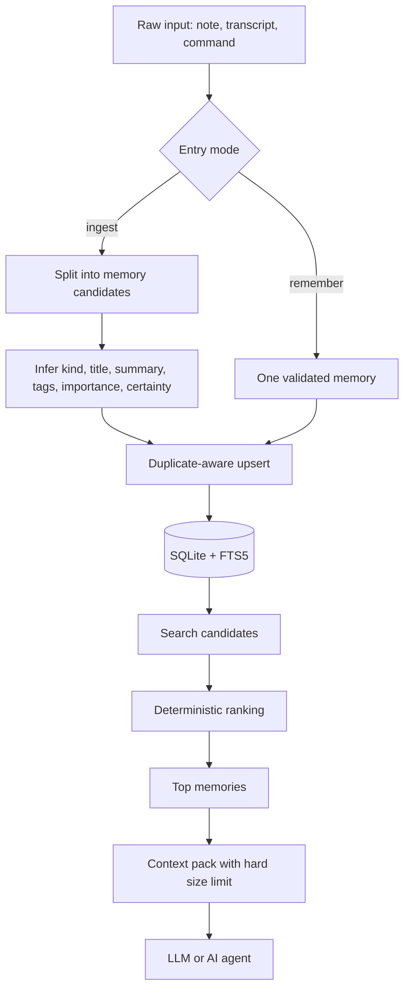
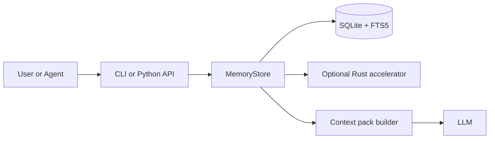

# Memory Kernel

<!-- mcp-name: io.github.Artem362/memory-kernel -->

`Memory Kernel` is a small local memory layer for AI agents.

It helps you save useful things such as decisions, constraints, tasks, facts, and notes in a local SQLite database, then pull back only the few memories that matter for the current task.

Published package name on PyPI: `amormorri-memory-kernel`
CLI command after install: `memory-kernel`

Practical guide in Ukrainian:
[docs/OPERATING_GUIDE_UK.md](docs/OPERATING_GUIDE_UK.md)

Release notes:
[CHANGELOG.md](CHANGELOG.md)

## Contents

- [What It Does](#what-it-does)
- [Start In 5 Minutes](#start-in-5-minutes)
- [Typical Workflow](#typical-workflow)
- [Which Command To Use](#which-command-to-use)
  - Write: [`remember`](#remember), [`ingest`](#ingest)
  - Read: [`search`](#search), [`context`](#context), [`wake-up`](#wake-up), [`stats`](#stats)
  - Inspect / edit: [`list`](#list), [`show`](#show), [`update`](#update), [`delete`](#delete)
  - Lifecycle: [`forget` / `restore`](#forget--restore), [`revise`](#revise), [`decay`](#decay)
  - Maintain: [`completion`](#completion), [`verify`](#verify)
  - Backup: [`export`](#export), [`import`](#import)
- [Use With An LLM (MCP)](#use-with-an-llm-mcp)
- [How It Works](#how-it-works)
  - [Data Flow](#data-flow)
  - [Component Diagram](#component-diagram)
  - [Memory Record Schema](#memory-record-schema)
  - [Ukrainian Inflection Bridging](#ukrainian-inflection-bridging)
- [Why It Stays Lightweight](#why-it-stays-lightweight)
- [Who It Is For](#who-it-is-for)
- [Project Status](#project-status)
- [Native Accelerator](#native-accelerator)
- [Feedback](#feedback)

## What It Does

In plain English, Memory Kernel does 4 things:

1. Stores memory locally on your machine.
2. Keeps memory structured enough to stay useful.
3. Finds relevant records without a heavy vector stack.
4. Builds a small context pack instead of dumping everything into the prompt.

This project is not trying to create a magical black-box memory. It is trying to create a memory layer you can inspect, control, export, and trust.

## Start In 5 Minutes

If you just want to try it, do this:

```powershell
pip install amormorri-memory-kernel
memory-kernel init
memory-kernel remember --scope my.project --kind decision --title "Keep memory local" --content "We store memory on the user's machine."
memory-kernel search "memory local"
memory-kernel export --format json --output exports\memory.json
```

What happened there:

1. `init` created a local database.
2. `remember` saved one clear memory.
3. `search` fetched it back.
4. `export` created a backup file you can move or restore later.

If you are using the repository instead of PyPI:

```powershell
pip install -e .[dev]
```

## Typical Workflow

Most people will use it like this:

1. Save one precise memory with `remember`.
2. Feed raw notes or transcripts with `ingest`.
3. Before an agent run, fetch only what matters with `search`, `context`, or `wake-up`.
4. Inspect, fix, or remove single records with `show`, `update`, or `delete`.
5. Periodically export the database for backup.
6. Restore it elsewhere with `import`.

## Which Command To Use

### `remember`

Use `remember` when you already know exactly what should be saved.

Good examples:

- a decision
- a rule
- a user preference
- a project constraint

```powershell
memory-kernel remember --scope project.alpha --kind decision --title "Use SQLite FTS5" --content "We use SQLite FTS5 for local retrieval."
```

### `ingest`

Use `ingest` when you have raw text and want the system to split it into structured memories.

Good examples:

- meeting notes
- a transcript
- a rough planning document
- an agent session log

```powershell
memory-kernel ingest --scope project.alpha --file notes.txt --source sprint-review --tags planning transcript
```

Add `--dry-run` to preview the segments and inferred kinds/titles/tags without writing to the database. Useful before committing a long file.

```powershell
memory-kernel ingest --scope project.alpha --file notes.txt --dry-run
memory-kernel ingest --scope project.alpha --text "..." --dry-run --json
```

Add `--interactive` for a guided flow that prompts for scope, source, tags, and the text itself, then shows a preview and asks for confirmation before saving. Helpful for first-time users or for ad-hoc captures from the terminal without remembering the flag names.

```powershell
memory-kernel ingest --interactive
```

### `search`

Use `search` when you want a few relevant exact memories for a query.

```powershell
memory-kernel search "context budget"
```

### `context`

Use `context` when you want a compact pack for an agent prompt.

```powershell
memory-kernel context "How do we keep memory cheap?" --budget-chars 700
```

### `wake-up`

Use `wake-up` when you want a small "hot memory" pack before a task starts.

```powershell
memory-kernel wake-up --budget-chars 500
```

### `stats`

Use `stats` when you want to see database size and whether the native accelerator is active.

```powershell
memory-kernel stats
memory-kernel stats --since 7d
memory-kernel stats --since 2026-04-01
```

`--since` adds recent-activity counts (created and updated since the cutoff) plus a per-kind breakdown for the window. Accepts either a relative form like `7d` or an ISO date.

### `list`

Use `list` to browse recent memories (most recently updated first) with optional filters.

```powershell
memory-kernel list
memory-kernel list --scope project.alpha --limit 50
memory-kernel list --kind decision --tags rust memory
memory-kernel list --json
```

Default limit is 20. The output shows `id`, `kind/scope`, `title`, and the timestamps so you can pipe ids into `show`/`update`/`delete`.

### `show`

Use `show` when you have a memory id (printed by `search`, `remember --json`, or `export`) and want the full record.

```powershell
memory-kernel show --id 9f1e8c0a4b2d4e7f8a1b2c3d4e5f6a7b
memory-kernel show --id 9f1e8c0a4b2d4e7f8a1b2c3d4e5f6a7b --json
```

### `update`

Use `update` to fix specific fields on an existing memory without re-importing the whole database.

```powershell
memory-kernel update --id 9f1e... --title "Renamed memory" --importance 0.95
memory-kernel update --id 9f1e... --tags rust memory acceleration
memory-kernel update --id 9f1e... --tags
```

Only the fields you pass change. Pass `--tags` with no values to clear tags. Pass `--kind`, `--importance`, or `--certainty` to revise validation-bound fields.

### `delete`

Use `delete` to drop a memory you saved by mistake or that no longer applies.

```powershell
memory-kernel delete --id 9f1e8c0a4b2d4e7f8a1b2c3d4e5f6a7b
```

The command exits non-zero if the id does not exist, so wrap it in shell logic if you script around it.

### `forget` / `restore`

`delete` removes a memory permanently. When you only want it out of recall but kept for safety, use `forget` — a soft-archive. Archived memories disappear from `search`, `context`, `wake-up`, and `list`, but the data stays and `restore` brings it back.

```powershell
memory-kernel forget --id 9f1e...
memory-kernel restore --id 9f1e...
memory-kernel list --include-archived   # see archived/superseded memories
```

Re-saving the same memory with `remember`/`ingest` also resurrects it automatically.

### `revise`

When a new memory replaces an old one, record the relationship with `revise`: the old memory is marked superseded (hidden from recall, kept for history with a pointer to its replacement).

```powershell
memory-kernel revise --id <new-id> --supersedes <old-id>
```

This keeps memory self-curating: stale decisions fade out of recall as newer ones take their place, instead of piling up as contradictory noise.

### `decay`

`decay` applies a forgetting curve: it auto-archives memories that are old, rarely recalled, and low-value, so the store and your recall stay lean over time. Each memory has a retention score built from its importance, how often it has been recalled (reinforcement), and how long since it was last seen (time decay).

```powershell
memory-kernel decay --dry-run          # preview what would fade
memory-kernel decay                    # apply (archives, recoverable)
memory-kernel decay --min-age-days 60 --max-access 0 --scope project.alpha
```

Only `note` and `fact` memories are eligible — `decision`, `constraint`, `task`, and `preference` are never decayed. Archiving is the soft, recoverable kind, so `restore` and `list --include-archived` still reach faded memories. This is the heart of the project's thesis: spend the budget on what matters, let trivia fade.

### `completion`

Use `completion` to print a shell completion script for `memory-kernel`. The script is generated dynamically from the current parser, so it stays in sync as commands are added.

```powershell
memory-kernel completion powershell | Out-File -Encoding utf8 $PROFILE.CurrentUserAllHosts -Append
memory-kernel completion bash > ~/.local/share/bash-completion/completions/memory-kernel
```

After installing, `memory-kernel <Tab><Tab>` shows all subcommands; `memory-kernel remember --<Tab>` lists flags for that command; `memory-kernel remember --kind <Tab>` cycles through valid `kind` values.

### `verify`

Use `verify` to check that the database is internally consistent: schema version is current, derived columns (`stems_text`, `fingerprint`) match the source content, and the FTS5 index row count matches the memories table.

```powershell
memory-kernel verify
memory-kernel verify --repair
memory-kernel verify --repair --json
```

Without `--repair`, exit code is `0` when healthy and `1` when issues are found. With `--repair`, mismatches are recomputed in-place and the FTS index is rebuilt if its row count drifted; exit code is `0` if everything was fixed.

Useful after restoring from a manual backup, after editing the database with raw SQL, or as a periodic sanity check in CI.

### `export`

Use `export` for backup, migration, or inspection.

```powershell
memory-kernel export --format json --output exports\memory.json
memory-kernel export --scope project.alpha --format jsonl --output exports\project-alpha.jsonl
```

### `import`

Use `import` to restore a previous export.

```powershell
memory-kernel import --file exports\memory.json
memory-kernel import --file exports\project-alpha.jsonl
```

`import` is idempotent for the same exported records because it upserts by memory `id`.

## Use With An LLM (MCP)

Memory Kernel ships an [MCP](https://modelcontextprotocol.io) server so an LLM can save and recall memories itself during a session. It works with Claude Desktop, Claude Code, Cursor, and any other MCP client, over stdio.

Install with the MCP extra:

```powershell
pip install "amormorri-memory-kernel[mcp]"
```

Run it directly to check it starts:

```powershell
memory-kernel-mcp --db .memory-kernel\memory.db
# or via the main CLI:
memory-kernel serve-mcp --db-path .memory-kernel\memory.db
```

Then register it with your client. For **Claude Desktop** (`claude_desktop_config.json`):

```json
{
  "mcpServers": {
    "memory-kernel": {
      "command": "memory-kernel-mcp",
      "env": { "MEMORY_KERNEL_DB": "C:\\Users\\you\\.memory-kernel\\memory.db" }
    }
  }
}
```

For **Claude Code / Cursor** (`.mcp.json` in the project root):

```json
{
  "mcpServers": {
    "memory-kernel": {
      "command": "memory-kernel-mcp",
      "args": ["--db", "${workspaceFolder}/.memory-kernel/memory.db"]
    }
  }
}
```

The server exposes seven tools:

| Tool | Purpose | Read-only |
|------|---------|-----------|
| `memory_remember` | Save one precise memory | no (dedup-merge, non-destructive) |
| `memory_ingest` | Split raw text into structured memories | no |
| `memory_forget` | Soft-archive a memory (recoverable) | no (reversible) |
| `memory_search` | Find relevant memories (Ukrainian forms bridged) | yes |
| `memory_build_context` | Budget-limited context pack for a prompt | yes |
| `memory_wake_up` | Hot-memory pack for session start | yes |
| `memory_list` | Browse recent memories | yes |
| `memory_stats` | Store statistics | yes |

`memory_forget` is exposed because it is reversible — an agent can let a stale memory fade, and a human can `restore` it from the CLI. Truly destructive edits (`delete`, `update`, `revise`) are deliberately **not** exposed over MCP: an agent can add, recall, and soft-forget, but only you can permanently rewrite or remove.

Tools take flat parameters, so the model sees `scope`, `kind`, `title`, … directly. Verify the whole protocol round-trip any time with `python scripts/mcp_smoke.py`, and see [docs/REAL_AI_TEST.md](docs/REAL_AI_TEST.md) for a hand-test script to run on a real model.

## How It Works

The core idea is simple:

1. Store exact text locally.
2. Search cheaply with `SQLite` and `FTS5`.
3. Rank results deterministically instead of fuzzily.
4. Return a small context pack with a hard character budget.

That is how Memory Kernel reduces both blur and overhead.

### Data Flow



### Component Diagram



### Memory Record Schema

```text
MemoryRecord
|- scope
|- kind
|- title
|- summary
|- content
|- tags
|- source
|- importance
|- certainty
|- access_count
|- created_at
|- updated_at
\- last_accessed_at
```

### Leaner Context Packs

When building a `context` or `wake-up` pack, Memory Kernel skips a memory whose content closely overlaps one already included (token-overlap above a threshold). Under the same character budget, the pack then carries more distinct facts and less repetition — directly lowering the redundant context handed to the model. Tune or disable per call with `dedup_threshold` (1.0 disables).

### Ukrainian Inflection Bridging

Search bridges Ukrainian morphology in two layers:

1. **Suffix stemming on the query** expands each term to a short stem (`вирішили` → `виріш*`). This finds `вирішили`, `вирішення`, `вирішує`, `вирішена` — anything sharing the same prefix.
2. **Deep stemming of stored content** (suffix + prefix stripping) lives in a separate `stems_text` column inside the FTS5 index. The query also matches against deep stems exactly (`stems_text:ріш`). This bridges across different prefixes, so a search for `рішення` also finds `вирішили` and `невирішене` — they all collapse to the same `ріш` stem.

Stored title/summary/content/tags stay exact, so fingerprints, deduplication, ranking, and export all remain deterministic. Only the FTS5 index gains a derived `stems_text` column.

Disable with:

```powershell
$env:MEMORY_KERNEL_DISABLE_STEMMER=1
```

Disabling only affects the query side. `stems_text` keeps being populated on writes so toggling the env back on does not require a rebuild.

## Why It Stays Lightweight

Memory Kernel stays small on purpose:

- `SQLite` + `FTS5` instead of a mandatory vector database
- deterministic ranking instead of fuzzy always-on retrieval
- duplicate-aware updates instead of endless memory growth
- hard context budgets instead of large prompt dumps
- optional `Rust` acceleration only where it actually helps

For embedded Python usage, `MemoryStore` keeps a long-lived SQLite connection for throughput. Prefer `with MemoryStore(...) as store:` or call `store.close()` when you are done.

## Who It Is For

This is a good fit when you want:

- local-first memory on your own machine
- clear records you can inspect
- small, predictable retrieval
- easy export and restore

This is a weaker fit when you want:

- a fully hosted managed platform
- zero local setup
- fully automatic cleanup of messy notes with no review

## Project Status

Current stage: working alpha.

Already working:

- package layout
- CLI
- tests
- export and import
- optional Rust accelerator
- Python fallback without Rust

Still in progress:

- prebuilt wheels for major platforms
- a simpler guided ingest flow
- even lighter onboarding for non-technical users

## Native Accelerator

The Python implementation is the stable default.

If you want lower overhead on ingest and heuristic hot paths, build the optional `Rust` module:

```powershell
.\scripts\build_native.ps1
```

After that, `memory-kernel stats` will show whether `accelerator: rust` is active.

You can benchmark the current hot paths with:

```powershell
python .\scripts\benchmark_ingest.py
python .\scripts\benchmark_upsert.py
```

Experimental native ranking is available for profiling:

```powershell
$env:MEMORY_KERNEL_EXPERIMENTAL_NATIVE_RANK=1
```

## License

Apache License 2.0 (see [LICENSE](LICENSE) and [NOTICE](NOTICE)). Versions up to and including 0.3.1 were released under the Unlicense and remain available under those terms; all later versions are Apache-2.0. Contributions require a DCO sign-off — see [CONTRIBUTING.md](CONTRIBUTING.md).

## Feedback

Issue tracker:
https://github.com/Artem362/memory-kernel/issues

Issue template chooser:
https://github.com/Artem362/memory-kernel/issues/new/choose

There is also a first-run feedback template in:
`.github/ISSUE_TEMPLATE/first-run-feedback.yml`

The most useful early report includes:

- where you installed from
- your OS and Python version
- the exact command you ran
- what you expected
- what actually happened
