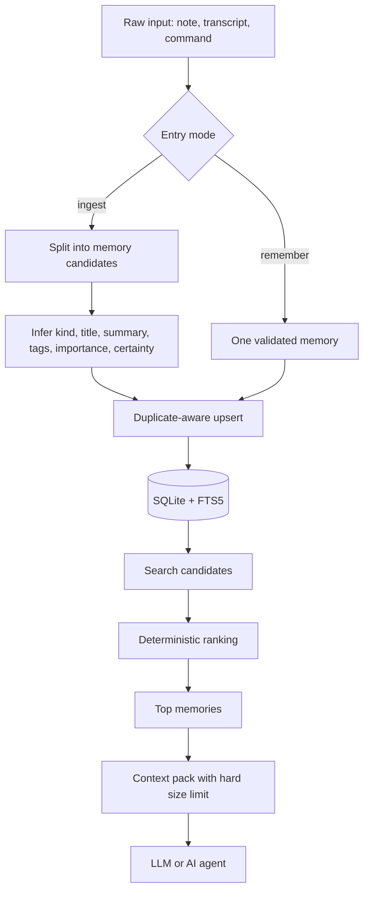
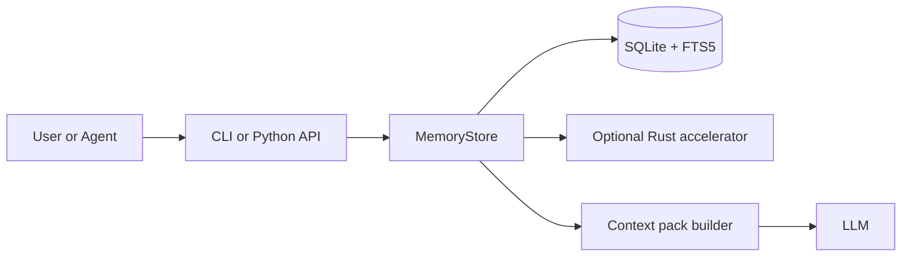

# Memory Kernel: проста інструкція для людини

Назва пакета на PyPI: `amormorri-memory-kernel`
Команда після встановлення: `memory-kernel`

## Що це простими словами

`Memory Kernel` — це локальна пам'ять для AI-агентів і LLM-застосунків.

Його задача не в тому, щоб "пам'ятати все підряд". Його задача в тому, щоб:

1. зберігати важливі речі локально на твоїй машині;
2. не роздувати пам'ять зайвим шумом;
3. повертати тільки той контекст, який реально потрібен зараз;
4. дозволяти легко зробити backup або перенести пам'ять на іншу машину.

Ідея проста: менше магії, більше контролю.

## Старт за 5 хвилин

Якщо хочеш просто спробувати систему, почни так:

```powershell
pip install amormorri-memory-kernel
memory-kernel init
memory-kernel remember --scope my.project --kind decision --title "Пам'ять локально" --content "Зберігаємо пам'ять на машині користувача."
memory-kernel search "пам'ять локально"
memory-kernel export --format json --output exports\memory.json
```

Що тут сталося:

1. `init` створив локальну базу пам'яті.
2. `remember` зберіг один точний запис.
3. `search` знайшов цей запис назад.
4. `export` зробив backup.

Цього вже достатньо, щоб відчути, як працює система.

Якщо ти працюєш із локального репозиторію, а не з PyPI:

```powershell
pip install -e .[dev]
```

## Як користуватись щодня

Найпростіший робочий сценарій такий:

1. Зберігай точні рішення через `remember`.
2. Закидай сирі нотатки або стенограми через `ingest`.
3. Перед задачею діставай потрібне через `search`, `context` або `wake-up`.
4. Періодично роби `export`, щоб мати backup.
5. Якщо треба перенести систему, використовуй `import`.

## Яку команду коли використовувати

### `remember`

Використовуй, коли ти вже чітко знаєш, що саме треба зберегти.

Підходить для:

- рішення;
- правила;
- обмеження;
- сталої переваги користувача.

```powershell
memory-kernel remember --scope project.alpha --kind decision --title "Use SQLite FTS5" --content "Ми використовуємо SQLite FTS5 для локального пошуку."
```

### `ingest`

Використовуй, коли в тебе є сирий текст, а не готовий структурований запис.

Підходить для:

- нотаток із зустрічі;
- стенограми;
- чернетки документа;
- логу роботи агента.

```powershell
memory-kernel ingest --scope project.alpha --file notes.txt --source sprint-review --tags planning transcript
```

### `search`

Використовуй, коли треба знайти кілька точних релевантних записів.

```powershell
memory-kernel search "контекст бюджет"
```

### `context`

Використовуй, коли треба підготувати короткий набір пам'яті для prompt.

```powershell
memory-kernel context "Як зробити пам'ять дешевою?" --budget-chars 700
```

### `wake-up`

Використовуй, коли треба стартовий маленький набір "гарячої" пам'яті без окремого запиту.

```powershell
memory-kernel wake-up --budget-chars 500
```

### `stats`

Використовуй, коли хочеш побачити стан бази й чи працює native accelerator.

```powershell
memory-kernel stats
```

### `export`

Використовуй для backup, переносу або аудиту.

```powershell
memory-kernel export --format json --output exports\memory.json
memory-kernel export --scope project.alpha --format jsonl --output exports\project-alpha.jsonl
```

### `import`

Використовуй, щоб відновити попередній export.

```powershell
memory-kernel import --file exports\memory.json
memory-kernel import --file exports\project-alpha.jsonl
```

Один і той самий export можна імпортувати повторно без безкінечного плодіння дублікатів, бо імпорт іде через upsert по `id`.

## Як це працює

Головна ідея дуже проста:

1. Пам'ять зберігається локально в `SQLite`.
2. Для дешевого пошуку використовується `FTS5`.
3. Результати не дістаються "магічно", а ранжуються детерміновано.
4. У модель потрапляє не вся база, а короткий `context pack` з лімітом символів.

Саме це зменшує і розмитість, і навантаження.

## Принцип роботи

### Що відбувається на практиці

1. У систему потрапляє або один точний запис через `remember`, або сирий текст через `ingest`.
2. Якщо це сирий текст, система ділить його на кандидати в пам'ять.
3. Для кожного кандидата визначаються `kind`, `title`, `summary`, `tags`, `importance`, `certainty`.
4. Запис іде в `SQLite`, а duplicate-aware логіка не дає базі розростатися дублями.
5. Під час пошуку `FTS5` знаходить кандидатів.
6. Далі кандидати ранжуються за змістом, важливістю, надійністю, свіжістю та повторним використанням.
7. Для моделі збирається короткий `context pack`, а не вивантажується вся пам'ять.

### Що тут найважливіше

- спочатку дешевий lexical retrieval;
- потім детерміноване ranking-рішення;
- потім жорсткий бюджет на фінальний контекст.

## Схеми

### Потік даних



### Схема компонентів



### Схема одного memory-запису

```text
MemoryRecord
|- scope
|- kind
|- title
|- summary
|- content
|- tags
|- source
|- importance
|- certainty
|- access_count
|- created_at
|- updated_at
\- last_accessed_at
```

## Чому це легше за важкі memory-стеки

- не потрібен обов'язковий vector DB;
- не потрібні постійні embedding-витрати;
- менше latency;
- простіше дебажити, бо записи видно явно;
- легше контролювати, що саме потрапляє в модель.

## Коли краще `remember`, а коли `ingest`

Обирай `remember`, якщо:

- запис уже сформульований;
- тобі важливо самому задати `kind`;
- це ключове рішення або правило.

Обирай `ingest`, якщо:

- у тебе багато сирого тексту;
- треба швидко перетворити нотатки на структуровану пам'ять;
- важливо не плодити дублікати.

## Як експортувати та імпортувати пам'ять

### Backup усієї пам'яті

```powershell
memory-kernel export --format json --output exports\memory-backup.json
```

### Backup одного проєкту

```powershell
memory-kernel export --scope project.alpha --format json --output exports\project-alpha.json
```

### Построчний експорт у `jsonl`

```powershell
memory-kernel export --scope project.alpha --format jsonl --output exports\project-alpha.jsonl
```

### Відновлення з backup

```powershell
memory-kernel import --file exports\memory-backup.json
memory-kernel import --file exports\project-alpha.jsonl
```

Що важливо:

- `export` нічого не змінює в базі;
- `import` підтримує `json` і `jsonl`;
- повторний імпорт того самого export не повинен плодити дублікати по `id`.

## Для кого це підходить

Найкраще підходить, якщо тобі потрібні:

- локальна пам'ять на своїй машині;
- контроль над тим, що саме зберігається;
- малий і передбачуваний контекст;
- простий backup і restore.

Слабше підходить, якщо ти хочеш:

- повністю hosted experience;
- максимум автоматизації без локального сетапу;
- consumer-продукт, де все працює "само" без дисципліни записів.

## Стадія проєкту

Поточна стадія: робоча alpha.

Вже є:

- CLI;
- тести;
- export / import;
- optional Rust accelerator;
- Python fallback без native-збірки;
- PyPI-пакет.

Ще в роботі:

- готові wheels для основних платформ;
- guided ingest для нетехнічного користувача;
- ще простіший onboarding.

## Native accelerator

Python-версія — це стабільний базовий шлях.

Якщо хочеш нижчий overhead на гарячому шляху, можна зібрати optional `Rust`-модуль:

```powershell
.\scripts\build_native.ps1
```

Після цього `memory-kernel stats` покаже, чи активний `accelerator: rust`.

Для замірів:

```powershell
python .\scripts\benchmark_ingest.py
python .\scripts\benchmark_upsert.py
```

Експериментальний native ranking можна вмикати для профілювання:

```powershell
$env:MEMORY_KERNEL_EXPERIMENTAL_NATIVE_RANK=1
```

## Фідбек від перших користувачів

Issue tracker:
https://github.com/Artem362/memory-kernel/issues

Швидкий вибір шаблону:
https://github.com/Artem362/memory-kernel/issues/new/choose

Шаблон first-run feedback уже лежить у:
`.github/ISSUE_TEMPLATE/first-run-feedback.yml`

Найкорисніший мінімум у фідбеку:

- звідки ставився пакет;
- ОС і версія Python;
- точна команда;
- що людина очікувала;
- що сталося насправді.
