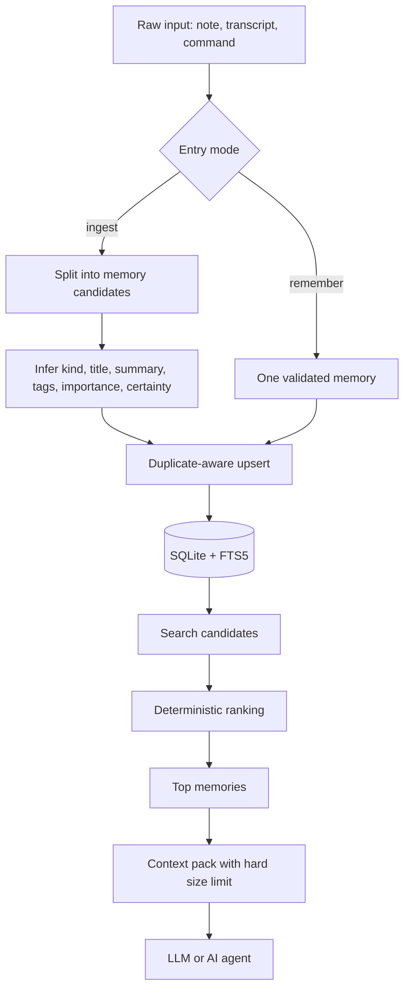
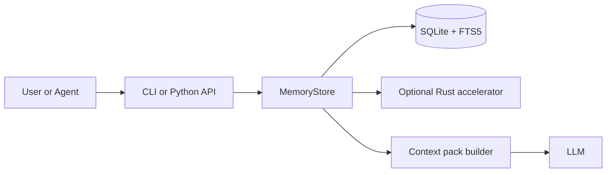

# Memory Kernel: проста інструкція для людини

Назва пакета на PyPI: `amormorri-memory-kernel`
Команда після встановлення: `memory-kernel`

## Що це простими словами

`Memory Kernel` — це локальна пам'ять для AI-агентів і LLM-застосунків.

Його задача не в тому, щоб "пам'ятати все підряд". Його задача в тому, щоб:

1. зберігати важливі речі локально на твоїй машині;
2. не роздувати пам'ять зайвим шумом;
3. повертати тільки той контекст, який реально потрібен зараз;
4. дозволяти легко зробити backup або перенести пам'ять на іншу машину.

Ідея проста: менше магії, більше контролю.

## Старт за 5 хвилин

Якщо хочеш просто спробувати систему, почни так:

```powershell
pip install amormorri-memory-kernel
memory-kernel init
memory-kernel remember --scope my.project --kind decision --title "Пам'ять локально" --content "Зберігаємо пам'ять на машині користувача."
memory-kernel search "пам'ять локально"
memory-kernel export --format json --output exports\memory.json
```

Що тут сталося:

1. `init` створив локальну базу пам'яті.
2. `remember` зберіг один точний запис.
3. `search` знайшов цей запис назад.
4. `export` зробив backup.

Цього вже достатньо, щоб відчути, як працює система.

Якщо ти працюєш із локального репозиторію, а не з PyPI:

```powershell
pip install -e .[dev]
```

## Як користуватись щодня

Найпростіший робочий сценарій такий:

1. Зберігай точні рішення через `remember`.
2. Закидай сирі нотатки або стенограми через `ingest` (з опційним `--dry-run`, щоб подивитись, як буде розпарсене, перед записом).
3. Перед задачею діставай потрібне через `search`, `context` або `wake-up`.
4. Переглядай, виправляй або видаляй окремі записи через `list`, `show`, `update`, `delete`.
5. Періодично роби `export`, щоб мати backup.
6. Якщо треба перенести систему, використовуй `import`.
7. Час від часу запускай `verify`, щоб переконатись, що похідні поля (`stems_text`, `fingerprint`) і FTS-індекс не розійшлись із джерелом.

## Яку команду коли використовувати

### `remember`

Використовуй, коли ти вже чітко знаєш, що саме треба зберегти.

Підходить для:

- рішення;
- правила;
- обмеження;
- сталої переваги користувача.

```powershell
memory-kernel remember --scope project.alpha --kind decision --title "Use SQLite FTS5" --content "Ми використовуємо SQLite FTS5 для локального пошуку."
```

### `ingest`

Використовуй, коли в тебе є сирий текст, а не готовий структурований запис.

Підходить для:

- нотаток із зустрічі;
- стенограми;
- чернетки документа;
- логу роботи агента.

```powershell
memory-kernel ingest --scope project.alpha --file notes.txt --source sprint-review --tags planning transcript
```

Додай `--dry-run`, щоб побачити, як система розіб'є текст на сегменти й що для них виведе (`kind`, `title`, `tags`, `importance`, `certainty`) — без запису в базу:

```powershell
memory-kernel ingest --scope project.alpha --file notes.txt --dry-run
memory-kernel ingest --scope project.alpha --text "..." --dry-run --json
```

Якщо не хочеться згадувати назви флагів — додай `--interactive`. Команда сама запитає `scope`, `source`, `tags`, потім дозволить вставити текст (Ctrl+Z + Enter на Windows або Ctrl+D на Linux/macOS завершує введення), покаже preview і запитає підтвердження перед записом.

```powershell
memory-kernel ingest --interactive
```

### `search`

Використовуй, коли треба знайти кілька точних релевантних записів.

```powershell
memory-kernel search "контекст бюджет"
```

### `context`

Використовуй, коли треба підготувати короткий набір пам'яті для prompt.

```powershell
memory-kernel context "Як зробити пам'ять дешевою?" --budget-chars 700
```

### `wake-up`

Використовуй, коли треба стартовий маленький набір "гарячої" пам'яті без окремого запиту.

```powershell
memory-kernel wake-up --budget-chars 500
```

### `stats`

Використовуй, коли хочеш побачити стан бази й чи працює native accelerator.

```powershell
memory-kernel stats
memory-kernel stats --since 7d
memory-kernel stats --since 2026-04-01
```

`--since` додає лічильники свіжої активності (скільки записів створено й оновлено від відрізку часу, плюс розбиття за `kind`). Приймає або відносний формат `7d`, або ISO-дату.

### `list`

Використовуй, щоб переглянути список свіжих записів із опційними фільтрами — натуральне доповнення до `show`/`update`/`delete`, бо без `id` ти не знаєш, що саме передавати.

```powershell
memory-kernel list
memory-kernel list --scope project.alpha --limit 50
memory-kernel list --kind decision --tags rust memory
memory-kernel list --json
```

За замовчуванням ліміт 20, сортування — найсвіжіші зверху (`updated_at DESC`).

### `show`

Використовуй, коли вже маєш `id` (з `list`, `search`, `remember --json` або `export`) і хочеш побачити повний запис.

```powershell
memory-kernel show --id 9f1e8c0a4b2d4e7f8a1b2c3d4e5f6a7b
memory-kernel show --id 9f1e8c0a4b2d4e7f8a1b2c3d4e5f6a7b --json
```

### `update`

Використовуй, щоб виправити окремі поля у вже збереженому записі — без re-import-у або редагування JSON.

```powershell
memory-kernel update --id 9f1e... --title "Нова назва" --importance 0.95
memory-kernel update --id 9f1e... --tags rust memory acceleration
memory-kernel update --id 9f1e... --tags
```

Змінюються тільки ті поля, які ти явно передав. `--tags` без значень очищує теги. Після оновлення `fingerprint` і `stems_text` перераховуються автоматично.

### `delete`

Використовуй, щоб прибрати запис, який зберігся помилково або більше не актуальний.

```powershell
memory-kernel delete --id 9f1e8c0a4b2d4e7f8a1b2c3d4e5f6a7b
```

Команда повертає ненульовий код, якщо `id` не знайдено — зручно для скриптів.

### `completion`

Використовуй, щоб згенерувати скрипт автодоповнення для shell. Скрипт будується з парсера динамічно, тому залишається актуальним при додаванні нових команд.

```powershell
memory-kernel completion powershell | Out-File -Encoding utf8 $PROFILE.CurrentUserAllHosts -Append
memory-kernel completion bash > ~/.local/share/bash-completion/completions/memory-kernel
```

Після встановлення `memory-kernel <Tab><Tab>` покаже всі команди, `memory-kernel remember --<Tab>` — флаги для цієї команди, `memory-kernel remember --kind <Tab>` — допустимі значення `kind`.

### `verify`

Використовуй, щоб перевірити, що база внутрішньо консистентна: схема правильної версії, похідні поля (`stems_text`, `fingerprint`) збігаються з контентом, кількість рядків у FTS-індексі дорівнює кількості записів у `memories`.

```powershell
memory-kernel verify
memory-kernel verify --repair
memory-kernel verify --repair --json
```

Без `--repair` exit code = `0` для здорової бази й `1` коли знайдено розходження. З `--repair` система перераховує неправильні поля на місці й, за потреби, перебудовує FTS-індекс — тоді exit code = `0`, якщо все вдалось виправити.

Корисно після відновлення з ручного backup, після прямого редагування БД через SQL або як періодична перевірка в CI.

### `export`

Використовуй для backup, переносу або аудиту.

```powershell
memory-kernel export --format json --output exports\memory.json
memory-kernel export --scope project.alpha --format jsonl --output exports\project-alpha.jsonl
```

### `import`

Використовуй, щоб відновити попередній export.

```powershell
memory-kernel import --file exports\memory.json
memory-kernel import --file exports\project-alpha.jsonl
```

Один і той самий export можна імпортувати повторно без безкінечного плодіння дублікатів, бо імпорт іде через upsert по `id`.

## Як це працює

Головна ідея дуже проста:

1. Пам'ять зберігається локально в `SQLite`.
2. Для дешевого пошуку використовується `FTS5`.
3. Результати не дістаються "магічно", а ранжуються детерміновано.
4. У модель потрапляє не вся база, а короткий `context pack` з лімітом символів.

Саме це зменшує і розмитість, і навантаження.

## Принцип роботи

### Що відбувається на практиці

1. У систему потрапляє або один точний запис через `remember`, або сирий текст через `ingest`.
2. Якщо це сирий текст, система ділить його на кандидати в пам'ять.
3. Для кожного кандидата визначаються `kind`, `title`, `summary`, `tags`, `importance`, `certainty`.
4. Запис іде в `SQLite`, а duplicate-aware логіка не дає базі розростатися дублями.
5. Під час пошуку `FTS5` знаходить кандидатів.
6. Далі кандидати ранжуються за змістом, важливістю, надійністю, свіжістю та повторним використанням.
7. Для моделі збирається короткий `context pack`, а не вивантажується вся пам'ять.

### Що тут найважливіше

- спочатку дешевий lexical retrieval;
- потім детерміноване ranking-рішення;
- потім жорсткий бюджет на фінальний контекст.

## Схеми

### Потік даних



### Схема компонентів



### Схема одного memory-запису

```text
MemoryRecord
|- scope
|- kind
|- title
|- summary
|- content
|- tags
|- source
|- importance
|- certainty
|- access_count
|- created_at
|- updated_at
\- last_accessed_at
```

## Робота з українською мовою

Memory Kernel свідомо враховує особливості української морфології, без важких залежностей.

### Апостроф не ламає токени

`canonicalize_text` спочатку прибирає всі варіанти апострофа (`'`, `'`, `'`, `ʼ`), а вже потім розбиває текст на слова. Тому `обов'язково` залишається одним токеном `обовязково` і коректно матчиться з KIND_HINTS, замість того щоб розпадатись на `обов` + `язково`. Те саме для `пам'ять`, `п'ять` тощо.

### Bridge через спільний корінь

Пошук розширює кожен термін у запиті в дві сторони:

1. **Суфіксний стем** (`light_stem`) дає префікс-вираз для FTS5: `вирішили` → `виріш*`. Це знаходить `вирішили`, `вирішення`, `вирішує`, `вирішена` — все, що починається з `виріш`.
2. **Глибокий стем** (`deep_stem` = суфікс + ітеративне зрізання префіксів `пере`/`роз`/`при`/`над`/`під`/`про`/`від`/`ви`/`за`/`на`/`по`/`до`/`не`/`об`) рахується для контенту під час запису й зберігається в окремій колонці `stems_text` всередині FTS5. Запит теж рахує deep stem і шукає його точно: `stems_text:ріш`. Це дозволяє знайти запис із `вирішили` за запитом `рішення` — обидва зводяться до `ріш`.

Оригінальний текст у `title`/`summary`/`content`/`tags` не змінюється, тому `fingerprint`, дедупа, ranking і export працюють як раніше — детерміновано й без розмитості.

### Як вимкнути

Якщо стемінг створює зайвий шум для твого випадку — вимкни через env-флаг (вплине тільки на запит, `stems_text` далі заповнюється на запис, тож при поверненні флагу не треба rebuild):

```powershell
$env:MEMORY_KERNEL_DISABLE_STEMMER=1
```

## Чому це легше за важкі memory-стеки

- не потрібен обов'язковий vector DB;
- не потрібні постійні embedding-витрати;
- менше latency;
- простіше дебажити, бо записи видно явно;
- легше контролювати, що саме потрапляє в модель.

## Коли краще `remember`, а коли `ingest`

Обирай `remember`, якщо:

- запис уже сформульований;
- тобі важливо самому задати `kind`;
- це ключове рішення або правило.

Обирай `ingest`, якщо:

- у тебе багато сирого тексту;
- треба швидко перетворити нотатки на структуровану пам'ять;
- важливо не плодити дублікати.

## Як експортувати та імпортувати пам'ять

### Backup усієї пам'яті

```powershell
memory-kernel export --format json --output exports\memory-backup.json
```

### Backup одного проєкту

```powershell
memory-kernel export --scope project.alpha --format json --output exports\project-alpha.json
```

### Построчний експорт у `jsonl`

```powershell
memory-kernel export --scope project.alpha --format jsonl --output exports\project-alpha.jsonl
```

### Відновлення з backup

```powershell
memory-kernel import --file exports\memory-backup.json
memory-kernel import --file exports\project-alpha.jsonl
```

Що важливо:

- `export` нічого не змінює в базі;
- `import` підтримує `json` і `jsonl`;
- повторний імпорт того самого export не повинен плодити дублікати по `id`.

## Для кого це підходить

Найкраще підходить, якщо тобі потрібні:

- локальна пам'ять на своїй машині;
- контроль над тим, що саме зберігається;
- малий і передбачуваний контекст;
- простий backup і restore.

Слабше підходить, якщо ти хочеш:

- повністю hosted experience;
- максимум автоматизації без локального сетапу;
- consumer-продукт, де все працює "само" без дисципліни записів.

## Стадія проєкту

Поточна стадія: робоча alpha.

Вже є:

- CLI з повним набором команд: `init`, `remember`, `ingest` (+ `--dry-run`), `search`, `context`, `wake-up`, `list`, `show`, `update`, `delete`, `verify`, `stats` (+ `--since`), `export`, `import`;
- українська-friendly канонікалізація (апостроф) і пошук із bridge через спільний корінь;
- тести (88+);
- export / import;
- native Rust accelerator з повним набором гарячих шляхів (інференс, ranking, дедупа, обчислення стемів);
- Python fallback без native-збірки;
- PyPI-пакет.

Ще в роботі:

- готові wheels для основних платформ;
- guided ingest для нетехнічного користувача;
- ще простіший onboarding.

## Native accelerator

Python-версія — це стабільний базовий шлях.

Якщо хочеш нижчий overhead на гарячому шляху, можна зібрати optional `Rust`-модуль:

```powershell
.\scripts\build_native.ps1
```

Після цього `memory-kernel stats` покаже, чи активний `accelerator: rust`.

Для замірів:

```powershell
python .\scripts\benchmark_ingest.py
python .\scripts\benchmark_upsert.py
```

Експериментальний native ranking можна вмикати для профілювання:

```powershell
$env:MEMORY_KERNEL_EXPERIMENTAL_NATIVE_RANK=1
```

## Фідбек від перших користувачів

Issue tracker:
https://github.com/Artem362/memory-kernel/issues

Швидкий вибір шаблону:
https://github.com/Artem362/memory-kernel/issues/new/choose

Шаблон first-run feedback уже лежить у:
`.github/ISSUE_TEMPLATE/first-run-feedback.yml`

Найкорисніший мінімум у фідбеку:

- звідки ставився пакет;
- ОС і версія Python;
- точна команда;
- що людина очікувала;
- що сталося насправді.
